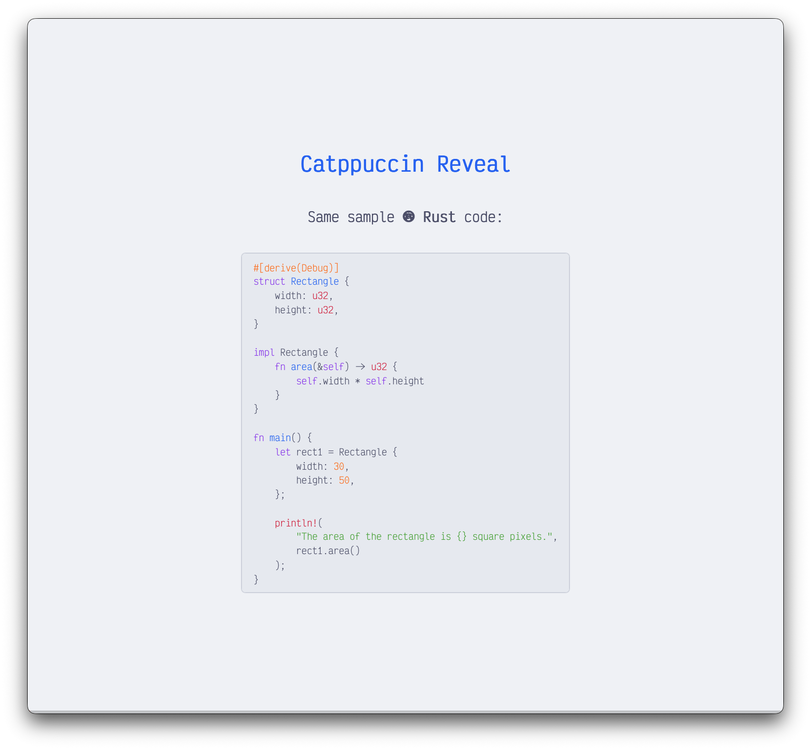

# catppuccin-reveal

This is a [Catppuccin](https://catppuccin.com/) theme for [reveal.js](https://revealjs.com/), specifically for use with [Obsidian Advanced Slides](https://mszturc.github.io/obsidian-advanced-slides/). It is entirely bespoke to me, only includes Frappé and Latte, and is subject to change at any time. That doesn't mean you can't use it, though! In fact, as usual, _**Contributions welcome™**_. For instance, adding mocha and macchiato would be easy peasy. Supporting other selectors would also be simple.

## 🚀 Installation

```bash
git clone this
./link.sh your/vault/path
```

## 🛠️ Usage

Install [Obsidian Advanced Slides](https://mszturc.github.io/obsidian-advanced-slides/) in Obsidian, then create a new slide deck and add the following to the frontmatter:

```yaml
theme: css/catppuccin/frappe.css
highlightTheme: css/highlightjs/catppuccin/frappe.css
```

## 📸 Screenshots

### Frappé

<p align="center"></p>

### Latte

<p align="center"></p>

## 🔠 Fonts

[Victor Mono](https://rubjo.github.io/victor-mono/) is used throughout, but we use the patched version from [Nerd Fonts](https://www.nerdfonts.com/). They are then compressed using [google/woff2](https://github.com/google/woff2). You don't need to do this unless you are adding faces.

```bash
git clone https://github.com/google/woff2.git && cd woff2
git submodule update --init
make clean all
./woff2_compress /path/to/font.ttf
```
